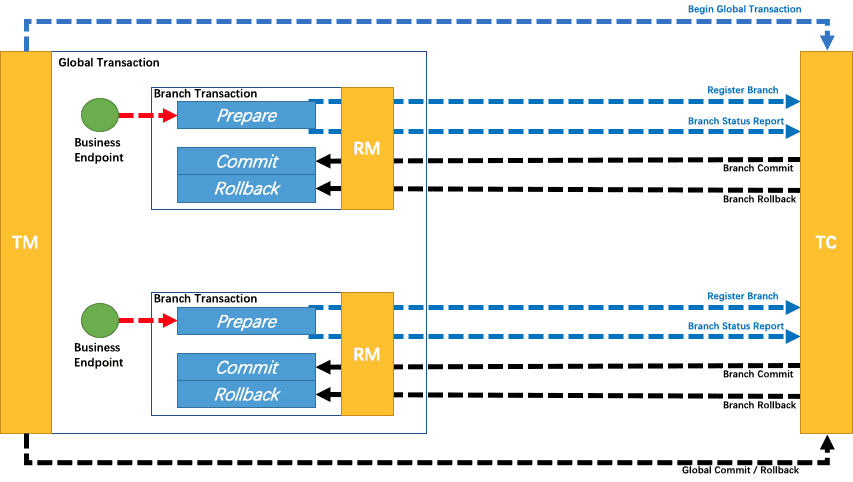

# Seata 

## Seata 是什么?

> Seata 是一款阿里巴巴开源的分布式事务解决方案，致力于在微服务架构下提供高性能和简单易用的分布式事务服务。
>
> Seata 将为用户提供了 AT、TCC、SAGA 和 XA 事务模式，为用户打造一站式的分布式解决方案。

## 三种身份

之前学习`TX-LCN`的时候说过 **Tx-Client** 和 **Tx-Manager** 两种身份。

而在Seata中有三种身份，但还是相通的。

###  事务协调者 - TC (Transaction Coordinator)

维护全局和分支事务的状态，驱动全局事务提交或回滚。

> 类似于 `TX-LCN` 中的 `TM`，作为一个全局的管理者，拥有最终的决策权（也就是发送提交还是回滚）

### 事务管理器  - TM (Transaction Manager) - 

定义全局事务的范围：开始全局事务、提交或回滚全局事务。

> 是RM的一种，类似于在`TX-LCN`中说到的`事务发起者`

### 资源管理器  -    RM (Resource Manager) 

管理分支事务处理的资源，与TC交谈以注册分支事务和报告分支事务的状态，并驱动分支事务提交或回滚。

> 每个参与事务的服务，类似于`TX-LCN`中的`TC`

## 四种模式

### AT

> AT 模式是一种无侵入的分布式事务解决方案。

#### 前提

- 基于支持本地 ACID 事务的关系型数据库。
- Java 应用，通过 **JDBC** 访问数据库。

#### 写隔离

- 一阶段本地事务提交前，需要确保先拿到 **全局锁** 。
- 拿不到 **全局锁** ，不能提交本地事务。
- 拿 **全局锁** 的尝试被限制在一定范围内，超出范围将放弃，并回滚本地事务，释放本地锁。

#### 原理

- **解析SQL**

  **执行业务前**会解析SQL得到 ：**操作类型**（UPDATE），**表名**（product），**条件**（where name = 'TXC'）等相关的信息。

  此时可以得到一个查询语句，可以定位到牵扯的数据。就例如

  ```sql
  selec * from product where name = 'TXC'
  ```

- **执行**

  执行这条SQL

- **主键定位**

  之前已经查到了该数据，这一步要通过主键id定位

  ```sql
  select * from product where id = 1;
  ```

- **插入回滚日志**

  把前后镜像数据以及业务 SQL 相关的信息组成一条回滚日志记录，插入到 `UNDO_LOG` 表中。

  ```json
  {
  	"branchId": 641789253,
  	"undoItems": [{
  		"afterImage": {
  			"rows": [{
  				"fields": [{
  					"name": "id",
  					"type": 4,
  					"value": 1
  				}, {
  					"name": "name",
  					"type": 12,
  					"value": "GTS"
  				}, {
  					"name": "since",
  					"type": 12,
  					"value": "2014"
  				}]
  			}],
  			"tableName": "product"
  		},
  		"beforeImage": {
  			"rows": [{
  				"fields": [{
  					"name": "id",
  					"type": 4,
  					"value": 1
  				}, {
  					"name": "name",
  					"type": 12,
  					"value": "TXC"
  				}, {
  					"name": "since",
  					"type": 12,
  					"value": "2014"
  				}]
  			}],
  			"tableName": "product"
  		},
  		"sqlType": "UPDATE"
  	}],
  	"xid": "xid:xxx"
  }
  ```

  

- **全局锁**

  提交前，向 TC 注册分支：申请 `product` 表中，主键值等于 1 的记录的 **全局锁** 。

- **本地事务提交**

  业务数据的更新和前面步骤中生成的 UNDO LOG 一并提交。

- **上报**

  将本地事务提交的结果上报给 TC。

  

  

#### 总结

- 无侵入开发者只需要专注于业务代码和SQL，配置后添加注解开箱即用无需额外的方法。

- 无状态，不会占用数据连接资。
- TC异步确认是否提交或者回滚，大幅提升效率
- 因为全局锁的存在，不持有全局锁无法提交本地事务，保证了写时不受其他影响，所以**不会存在脏写的问题**

### TCC



所谓 TCC 模式，是指支持把 **自定义** 的分支事务纳入到全局事务的管理中。

需要自行定义：**Try**、**Confirm**、**Cancel** 三个方法

### SAGA

### XA 

