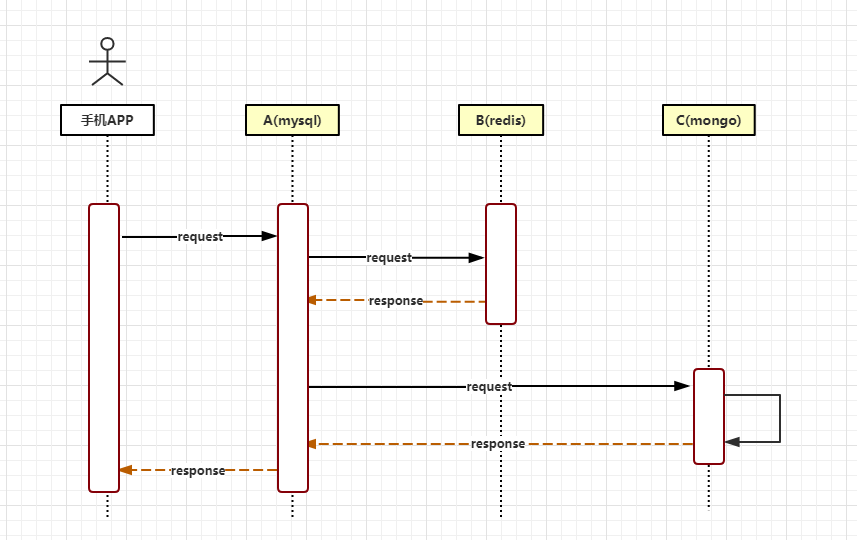

# TX-LCN分布式事务框架

## 简介

首先介绍下**TX-LCN**：

TX-LCN定位于一款事务协调性框架，框架其本身并不操作事务，而是基于对事务的协调从而达到事务一致性的效果。

> LCN并不生产事务，LCN只是本地事务的协调工

### TC 和  TM

**TC**、**TM** 分别对应着 **Tx-Client** 和  **Tx-Manager**

其实就是服务端和客户端，服务端可以注册到`Eureka`并做负载做集群

客户端就是需要做事务的业务代码，使用几个简单的注解即可使用

## 核心流程

### 流程图

### 执行步骤

- **创建事务组**
  是指在事务发起方开始执行业务代码之前先调用TxManager创建事务组对象，然后拿到事务标示GroupId的过程。

  > 可以理解为创建了一个分组，这个分组就是用来存储不同的事务的。

  

- **加入事务组**
  添加事务组是指参与方在执行完业务方法以后，将该模块的事务信息通知给TxManager的操作。

  > 业务不断执行，需要事务的操作一个个出现，将同一流程的放到一个事务组中

  

- **通知事务组**
  是指在发起方执行完业务代码以后，将发起方执行结果状态通知给TxManager,TxManager将根据事务最终状态和事务组的信息来通知相应的参与模块提交或回滚事务，并返回结果给事务发起方。

  > 业务代码执行完毕后会得到一个结果：**执行** 或者 **回滚** ， 找到对应的事务组，将其中的事务执行同一个操作

## 三大模式

上面所说核心流程算是列出了一个架子，具体还是要看三大模式。

三大模式差别还是很大的，也可以相互组合适用于多种不同的场景。

### LCN

#### 介绍

>  LCN模式是通过代理Connection的方式实现对本地事务的操作，然后在由TxManager统一协调控制事务。当本地事务提交回滚或者关闭连接时将会执行假操作，该代理的连接将由LCN连接池管理。

#### 模式特点

- **该模式对代码的嵌入性为低。**

  > 不需要改动太多的业务代码只需要添加相应的注解和配置即可，可以做到开箱即用。

  

- **该模式仅限于本地存在连接对象且可通过连接对象控制事务的模块。**

  > 该模式对数据库连接有一定的要求

  

- **该模式下的事务提交与回滚是由本地事务方控制，对于数据一致性上有较高的保障。**

  > LCN依赖于本地事务

  

- **该模式缺陷在于代理的连接需要随事务发起方一共释放连接，增加了连接占用的时间。**

  > 最重要的一点：该模式原理是实现了数据连接`Connection `，做了一层封装。在`close`的时候做了一次假释放，对`Connection `说连接释放了，但是其实最终由`TM`决定。假释放就是在等待其他事务执行结束，期间连接一直保持非常占用数据库连接池的资源，所以慎用。
  >
  > **但是：**可以选择连接池分组，业务代码的连接池和事务的连接池独立开，不会因为事务连接到用户。

### TCC

#### 介绍

> TCC事务机制相对于传统事务机制（X/Open XA Two-Phase-Commit），其特征在于它不依赖资源管理器(RM)对XA的支持，而是通过对（由业务系统提供的）业务逻辑的调度来实现分布式事务。主要由三步操作，Try: 尝试执行业务、 Confirm:确认执行业务、 Cancel: 取消执行业务。

#### 特点

- 该模式对代码的嵌入性高，要求每个业务需要写三种步骤的操作。

  > 嵌入型高，需要对执行事务的业务代码进行改造，原本一步完成的数据库操作现在需要三步：
  >
  > 1. 正常的执行SQL
  > 2. 确认
  > 3. 回滚
  >
  > 其中`1`是必须执行的，`2`和`3`只执行一条，因为需要`TM`发出执行是确认还是回滚。

- 该模式对有无本地事务控制都可以支持使用面广。

  > 一大优势：没有什么依赖性不需要要求本地支持事务，因为执行是通过**逆SQL**来实现的。

  

- 数据一致性控制几乎完全由开发者控制，对业务开发难度要求高。

  > 可以理解为TCC为开发搭好了舞台，具体事务怎么跳就看开发者了。
  >
  > 但是同样对应了一个优点，面对的业务更宽泛了，可以自由定制

### TXC

#### 介绍

> TXC模式命名来源于淘宝，实现原理是在执行SQL之前，先查询SQL的影响数据，然后保存执行的SQL快走信息和创建锁。当需要回滚的时候就采用这些记录数据回滚数据库，目前锁实现依赖redis分布式锁控制

#### 特点

- 该模式同样对代码的嵌入性低。

  > 同LCN ， 业务代码影响少

  

- 该模式仅限于对支持SQL方式的模块支持。

  > 限制：仅支持SQL方式

  

- 该模式由于每次执行SQL之前需要先查询影响数据，因此相比LCN模式消耗资源与时间要多。

  > 对比LCN会消耗更多的时间和数据库资源

  

- 该模式不会占用数据库的连接资源。

  > 不会占用数据库连接，也就是说没有使用假释放
  >
  > 官方定义该模式为**无状态**，即一切操作均为脱离数据库连接资源的

##  业务流程

## 案例

### LCN + TCC 配合使用

这是一张官网的图片：

客户端调用了`A服务`，随后又相继调用了`B服务`和`C服务`。有意思的就在A是`Mysql` ，B和C分别使用了`Redis`和`MongoDB`。

方案：采用TX-LCN分布式事务框架，则可以将A模块采用LCN模式、B/C采用TCC模式就能完美解决。