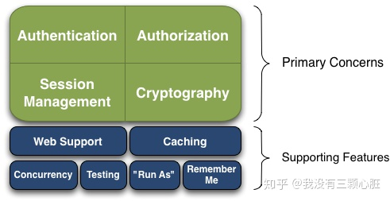

# 简介

> **Apache Shiro™**是一个强大且易用的Java安全框架,能够用于身份验证、授权、加密和会话管理。Shiro拥有易于理解的API,您可以快速、轻松地获得任何应用程序——从最小的移动应用程序到最大的网络和企业应用程序。

Shiro能到底能做些什么呢？

- 验证用户身份
- 用户访问权限控制，比如：1、判断用户是否分配了一定的安全角色。2、判断用户是否被授予完成某个操作的权限
- 在非 Web 或 EJB 容器的环境下可以任意使用Session API
- 可以响应认证、访问控制，或者 Session 生命周期中发生的事件
- 可将一个或以上用户安全数据源数据组合成一个复合的用户 “view”(视图)
- 支持单点登录(SSO)功能
- 支持提供“Remember Me”服务，获取用户关联信息而无需登录

# 为什么使用 Shiro

- **易于使用**——易用性是项目的最终目标。应用程序安全非常令人困惑和沮丧,被认为是“不可避免的灾难”。如果你让它简化到新手都可以使用它,它就将不再是一种痛苦了。
- **全面**——没有其他安全框架的宽度范围可以同Apache Shiro一样,它可以成为你的“一站式”为您的安全需求提供保障。
- **灵活**——Apache Shiro可以在任何应用程序环境中工作。虽然在网络工作、EJB和IoC环境中可能并不需要它。但Shiro的授权也没有任何规范,甚至没有许多依赖关系。
- **Web支持**——Apache Shiro拥有令人兴奋的web应用程序支持,允许您基于应用程序的url创建灵活的安全策略和网络协议(例如REST),同时还提供一组JSP库控制页面输出。
- **低耦合**——Shiro干净的API和设计模式使它容易与许多其他框架和应用程序集成。你会看到Shiro无缝地集成Spring这样的框架, 以及Grails, Wicket, Tapestry, Mule, Apache Camel, Vaadin…等。
- **被广泛支持**——Apache Shiro是Apache软件基金会的一部分。项目开发和用户组都有友好的网民愿意帮助。这样的商业公司如果需要Katasoft还提供专业的支持和服务。

# 特性


Apache Shiro是一个全面的、蕴含丰富功能的安全框架。下图为描述Shiro功能的框架图：



## 四大基石：

- **Authentication（认证）：**用户身份识别，通常被称为用户“登录”
- **Authorization（授权）：**访问控制。比如某个用户是否具有某个操作的使用权限。
- **Session Management（会话管理）：**特定于用户的会话管理,甚至在非web 或 EJB 应用程序。
- **Cryptography（加密）：**在对数据源使用加密算法加密的同时，保证易于使用。


## 三大概念

- **Subject：**当前用户，Subject 可以是一个人，但也可以是第三方服务、守护进程帐户、时钟守护任务或者其它–当前和软件交互的任何事件。
- **SecurityManager：**管理所有Subject，SecurityManager 是 Shiro 架构的核心，配合内部安全组件共同组成安全伞。
- **Realms：**用于进行权限信息的验证，我们自己实现。Realm 本质上是一个特定的安全 DAO：它封装与数据源连接的细节，得到Shiro 所需的相关的数据。在配置 Shiro 的时候，你必须指定至少一个Realm 来实现认证（authentication）和/或授权（authorization）。


## 认证流程


# 实例

```xml
<dependency>
    <groupId>org.apache.shiro</groupId>
    <artifactId>shiro-core</artifactId>
    <version>1.4.0</version>
</dependency>

<dependency>
    <groupId>junit</groupId>
    <artifactId>junit</artifactId>
    <version>RELEASE</version>
    <scope>test</scope>
</dependency>
```


## 最简单的认证流程

```java
public class Test {

    SimpleAccountRealm simpleAccountRealm = new SimpleAccountRealm();

    @Before
    public void addUser() {
        // 在方法开始前添加一个用户
        simpleAccountRealm.addAccount("admin", "admin");
    }

    @Test
    public void Test01(){
        DefaultSecurityManager defaultSecurityManager = new DefaultSecurityManager();
        defaultSecurityManager.setRealm(simpleAccountRealm);
		
        // 设置SecurityManager环境
        SecurityUtils.setSecurityManager(defaultSecurityManager); 
        // 获取当前主体
        Subject subject = SecurityUtils.getSubject(); 

        UsernamePasswordToken token = new UsernamePasswordToken("admin", "admin");
        try{
            subject.login(token);
        }catch (UnknownAccountException unknownAccountException){
            System.out.println("用户不存在:"+token.getUsername());
        }catch (IncorrectCredentialsException incorrectCredentialsException){
            System.out.println("密码错误");
        }

        System.out.println(token);

        System.out.println("是否已登录:" + subject.isAuthenticated()); 
        
        // 退出登录
        subject.logout(); 

        System.out.println("是否已登录:" + subject.isAuthenticated()); 
    }
}

// 输出结果
是否已登录:true
是否已登录:false
   
```


 如果使用错误的用户名：

```java
用户不存在:admin123
是否已登录:false
是否已登录:false
```


 如果使用错误的密码：

```java
UsernamePasswordToken token = new UsernamePasswordToken("admin", "123456");

// 输出结果
密码错误
是否已登录:false
是否已登录:false
```


