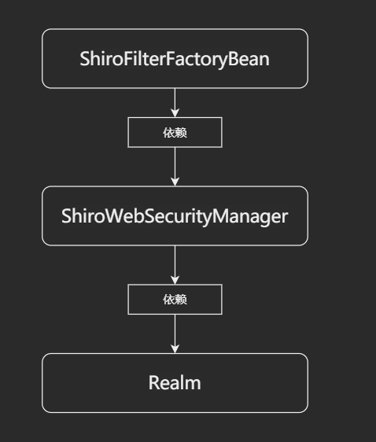

# 在 SpringBoot 中集成 Shiro

## 引入依赖

```xml
<dependency>
    <groupId>org.apache.shiro</groupId>
    <artifactId>shiro-core</artifactId>
    <version>1.4.0</version>
</dependency>
<dependency>
    <groupId>org.apache.shiro</groupId>
    <artifactId>shiro-web</artifactId>
    <version>1.4.0</version>
</dependency>
<dependency>
    <groupId>org.apache.shiro</groupId>
    <artifactId>shiro-spring</artifactId>
    <version>1.4.0</version>
</dependency>
```


## 集成



配置中要求实现三大类：`ShiroFilterFactoryBean`、`ShiroWebSecurityManager`、`Realm`

其中`Realm`是需要自定义的

### 自定义 Realm

先创建类，内容后续填上

```java
// 自定义一个 Realm
public class UserRealm extends AuthorizingRealm {
    // 执行授权逻辑
    @Override
    protected AuthorizationInfo doGetAuthorizationInfo(PrincipalCollection principalCollection) {
        System.out.println("执行授权逻辑");
        return null;
    }

    // 执行认证逻辑
    @Override
    protected AuthenticationInfo doGetAuthenticationInfo(AuthenticationToken authenticationToken) throws AuthenticationException {
        System.out.println("执行认证逻辑");
        return null;
    }
}
```


### 配置类

`lksun.lkschool.config.ShiroConfig`

```java
// 不要忘记这个
@Configuration
public class ShiroConfig {

    @Autowired
    UserRealm userRealm;
    @Autowired
    DefaultSecurityManager defaultSecurityManager;


    // 创建 ShiroFilterFactoryBean
    @Bean
    public ShiroFilterFactoryBean getShiroFilterFactoryBean(){
        ShiroFilterFactoryBean shiroFilterFactoryBean = new ShiroFilterFactoryBean();
        // 设置安全管理器
        shiroFilterFactoryBean.setSecurityManager(defaultSecurityManager);  
        return shiroFilterFactoryBean;
    }

    // 创建 ShiroWebSecurityManager
    @Bean(name = "defaultSecurityManager")
    public DefaultWebSecurityManager setDefaultSecurityManager(){
        // 注意不要new错了 DefaultWebSecurityManager 、 DefaultSecurityManager 傻傻分不清楚
        DefaultWebSecurityManager defaultSecurityManager = new DefaultWebSecurityManager();
        // 设置域
        defaultSecurityManager.setRealm(userRealm);
        return defaultSecurityManager;
    }

    // 创建 Realm
    @Bean(name = "userRealm")
    public UserRealm getRealm(){
        return new UserRealm();
    }

}

```


## 结果

> 证明已经将`Shiro` 和 `SpringBoot` 完美整合
>
> 创建了几个方法，通过过滤器进行拦截

```java
@RestController
public class Controller {
    @RequestMapping(value = "/login",method = RequestMethod.GET)
    public String login(){
        return "login page";
    }

    @RequestMapping(value = "/register",method = RequestMethod.GET)
    public String register(){
        return "register page";
    }
    
     @RequestMapping(value = "/baba",method = RequestMethod.GET)
    public String baba(){
        return "baba page";
    }
}
```


```java
// 创建 ShiroFilterFactoryBean
@Bean
public ShiroFilterFactoryBean getShiroFilterFactoryBean(){
    ShiroFilterFactoryBean shiroFilterFactoryBean = new ShiroFilterFactoryBean();

    // 设置安全管理器
    shiroFilterFactoryBean.setSecurityManager(defaultSecurityManager);

    // 设置过滤器
    HashMap<String, String> filterMap = new HashMap<>();
    filterMap.put("/login","anon");  // login页面允许未登录访问
    filterMap.put("/baba","authc");  // baba页面则不允许未登录访问
    shiroFilterFactoryBean.setFilterChainDefinitionMap(filterMap);

    // 配置未登录跳转页
    shiroFilterFactoryBean.setLoginUrl("/login");
    return shiroFilterFactoryBean;
}
```


分别尝试访问一下：`/login`和`/baba`

- 访问`/login`一切正常

  

- 访问`/baba`，因为已经做了过滤则自动重定向到了登录页

