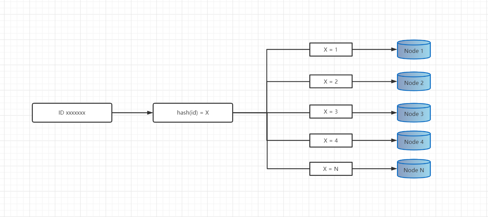
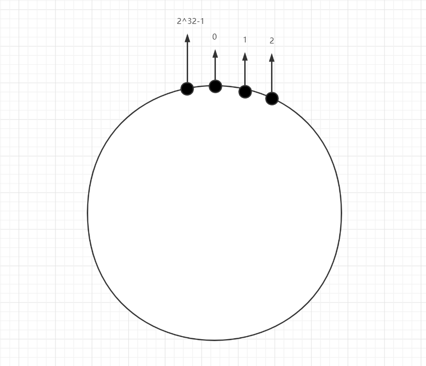
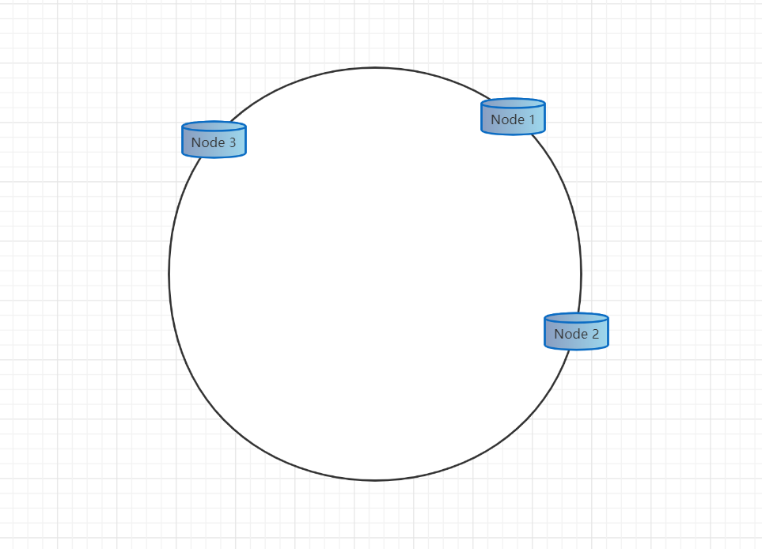
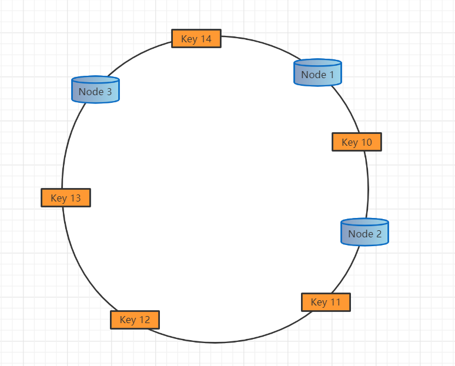
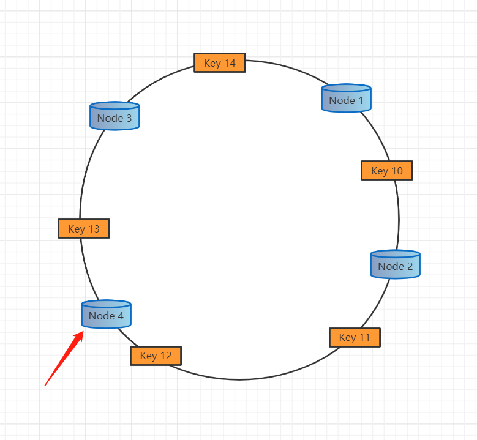
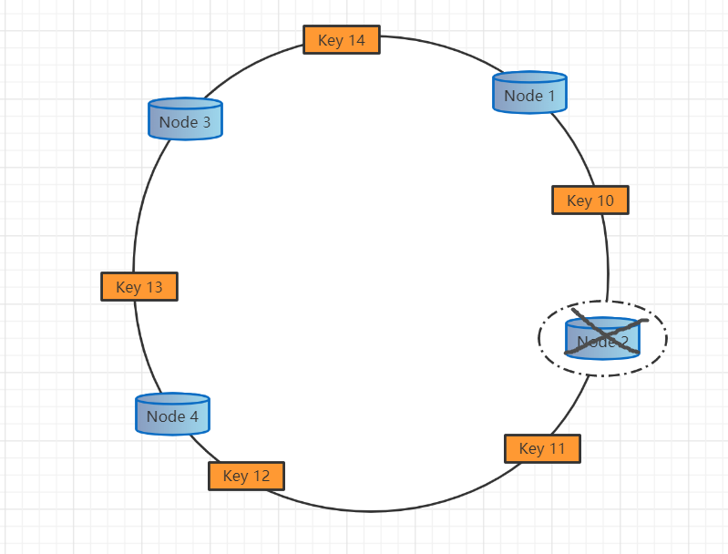
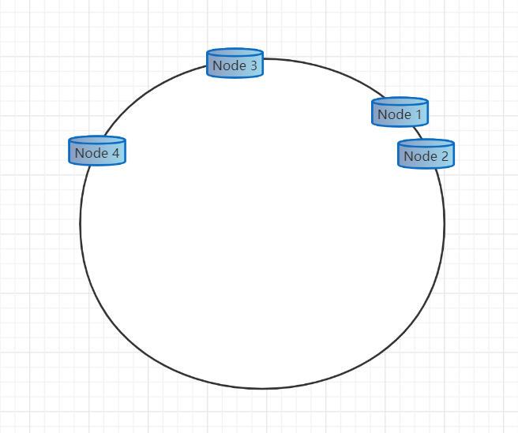
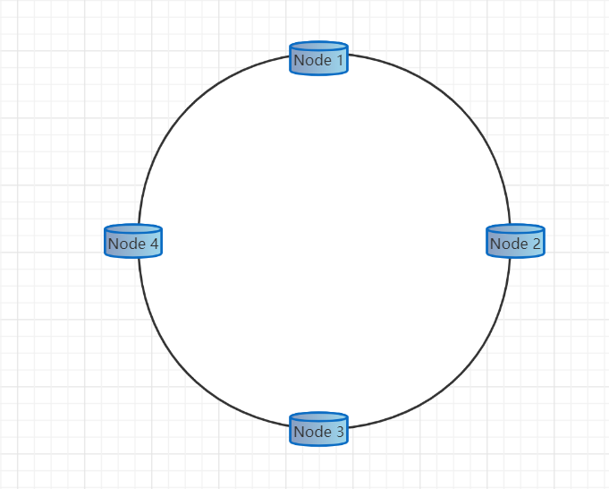

# **应用场景**

当我们的数据表超过500万条或更多时，我们就会考虑到采用分库分表；当我们的系统使用了一台缓存服务器还是不能满足的时候，我们会使用多台缓存服务器，那我们如何去访问背后的库表或缓存服务器呢，我们肯定不会使用循环或者随机了，我们会在存取的时候使用相同的哈希算法定位到具体的位置。

# **简单的哈希算法**

我们可以根据某个字段（比如id）取模，然后将数据分散到不同的数据库或表中。

例如前期规划，我们某个业务数据5个库就能满足了，根据id取模 如下图

# **一致性哈希算法**

## 算法概述

一致性哈希算法（Consistent Hashing），是MIT的karge及其合作者在1997年发表的学术论文提出的，最早在论文《Consistent Hashing and Random Trees: Distributed Caching Protocols for Relieving Hot Spots on the World Wide Web》中被提出。简单来说，一致性哈希将整个哈希值空间组织成一个虚拟的圆环，如假设某哈希函数H的值空间为0 - 2^32-1（即哈希值是一个32位无符号整形），整个哈希空间环如下：

## 初始化哈希环

服务器（ip或者主机名）本身进行哈希，确认每台机器在哈希环上的位置，例如ip：192.168.4.101，192.168.4.102，192.168.4.103 分别对应节点node1，node2，node3 如图

数据key使用相同的函数计算出哈希值h，根据h确定此数据在环上的位置，从此位置沿环顺时针“行走”，最近的服务器就是其应该定位到的服务器。例如 我们使用"10","11","12","13","14" 四个数据对象对应key10,key11，key12，key13，key14，经过哈希计算后，在环空间的位置如下：

根据一致性哈希算法：

- `Key 14` 存在`Node 1`
- `Key 10` 存在`Node 2`
- `Key 11`、`Key 12`、`Key 13` 存在`Node 2`

## 创建节点

如果我们新增一个节点node4 对应的ip：192.168.4.104通过对应的哈希算法得到哈希值，并映射到环中，如下图

通过按顺时针迁移的规则，那么`Key 12`将从`Node 3`迁移到了`Node 4`中，其它数据还保持这原有的存储位置

> 如果想添加新节点但是又不得迁移数据呢 ?
>
> 不去迁移数据的话在下次查询的时候时按照新的节点肯定是得不到想要的结果的，但是如果第一次找不到继续往上一个节点找总是可以找到的。**注意实际业务场景！注意实际业务场景！注意实际业务场景！**根据可以接受的复杂度去执行，不适用所有场景。

## 删除节点

如果删除一个节点`Node 2`，那么按照顺时针迁移的方法，`Key 10`将会被迁移到`Node 4`上，其它的对象没有任何的改动。如下图：

# 可能出现问题

## 数据倾斜

如图：`Node 2`节点压力过轻，而`Node 4` 压力过大容易出现问题

其实我们可以提前设定好四个节点的位置

# 总结

Hash一致性算法可有效帮助在集群环境中如何快速插入、查询某一条属于所归属的节点。

