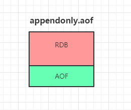

# 持久化

**Redis**讲数据存在内存应该是都知道的，如果出现突然的宕机数据岂不是瞬间爆炸人间蒸发。

持久化就是将有用**Redis**数据一直存着不会防止数据的丢失

Redis 提供了两种方式

## RDB （Redis-Data-Base）

将`redis`在内存中的的状态保存到硬盘中，它可以**手动执行**，也可以在 `redis.conf`中配置，**定期执行**。

RDB持久化产生的RDB文件是一个经过压缩的二进制文件，这个文件被保存在硬盘中，redis可以通过这个文件还原数据库当时的状态。

RDB持久化相当于备份数据库状态，类似打写快照

## AOF（Append-Only-File ）

份数据库接收到的命令，所有被写入AOF的命令都是以redis的协议格式来保存的。

在AOF持久化的文件中，数据库会记录下所有**变更数据库状态的命令**，除了指定数据库的select命令，其他的命令都是来自client的，这些命令会以追加(append)的形式保存到文件中。

# 对比

- `AOF`更安全，可将数据及时同步到文件中，但需要较多的磁盘IO，`AOF文件`尺寸较大，文件内容恢复相对较慢， 也更完整。
- `RDB`持久化，安全性较差，它是正常时期数据备份及 `master-slave`数据同步的最佳手段，文件尺寸较小，恢复数度较快。

# 混合持久化

AOF在进行文件重写(aof文件里可能有太多没用指令，所以aof会定期根据内存的最新数据生成aof文件)

时将重写这一刻之前的内存rdb快照文件的内容和增量的AOF修改内存数据的命令日志文件存在一起，

都写入新的aof文件，新的文件一开始不叫appendonly.aof，等到重写完新的AOF文件才会进行改名，

原子的覆盖原有的AOF文件，完成新旧两个AOF文件的替换。




## 配置

```shell
aof-use-rdb-preamble yes   
```

