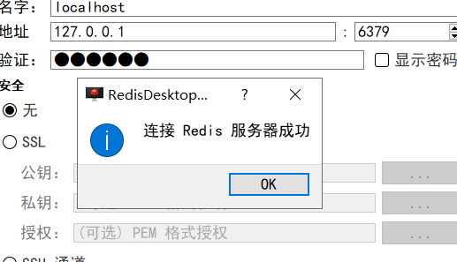

# 创建

```shell
docker run -d -p 6379:6379 --restart=always --name redis  -v D:\Docker\redis\conf\redis.conf:/usr/local/etc/redis/redis.conf -v D:\Docker\redis\data:/data docker.io/redis:5 redis-server /usr/local/etc/redis/redis.conf --appendonly yes
```


> 注意：D:\Docker\redis\conf\redis.conf 是一个文件不是目录，可以提前创建
>
> --appendonly yes 表示配置数据持久化
>
> /usr/local/etc/redis/redis.conf 表示启动时的配置


# 配置

`/usr/local/etc/redis/redis.conf` 下配置一个密码

```properties
requirepass 123456
```


# 连接

使用的可视化管理工具

